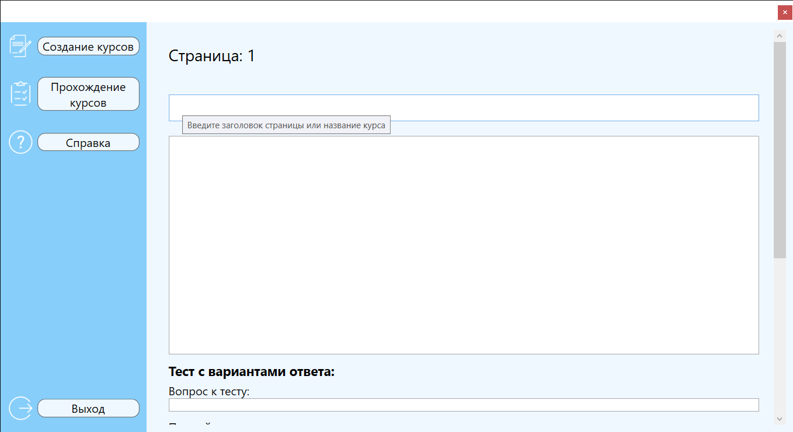
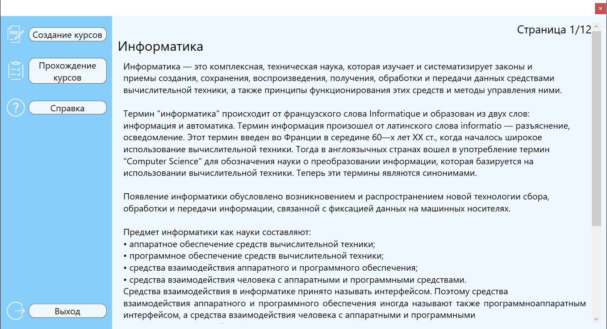
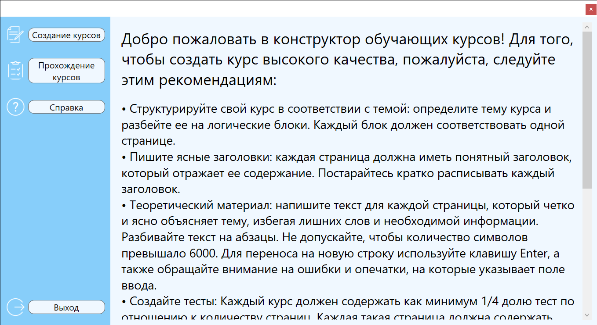

# CourseLearning_Lite
Десктопное приложение «CourseLearning» предназначено для создания и прохождения обучающих курсов. Это вторая вариация, в которой вырезана авторизация, регистрация профилей через базу данных PostgreSQL.   
Готовый курс сохраняется в JSON файле и может быть открыт другим пользователем в этом же приложении.

В планах: 
- Исправление ошибки, из за которой ломается итератор при возвращение на предыдущую страницу, во время создания курса
- Перенести окна в отдельную папку

| Страница создания курса             |
| ----------------------------------- |
|  |
| Страница прохождения курса          |
| ----------------------------------- |
|  |
| Справка                                     |
| ------------------------------------------- |
|  |
